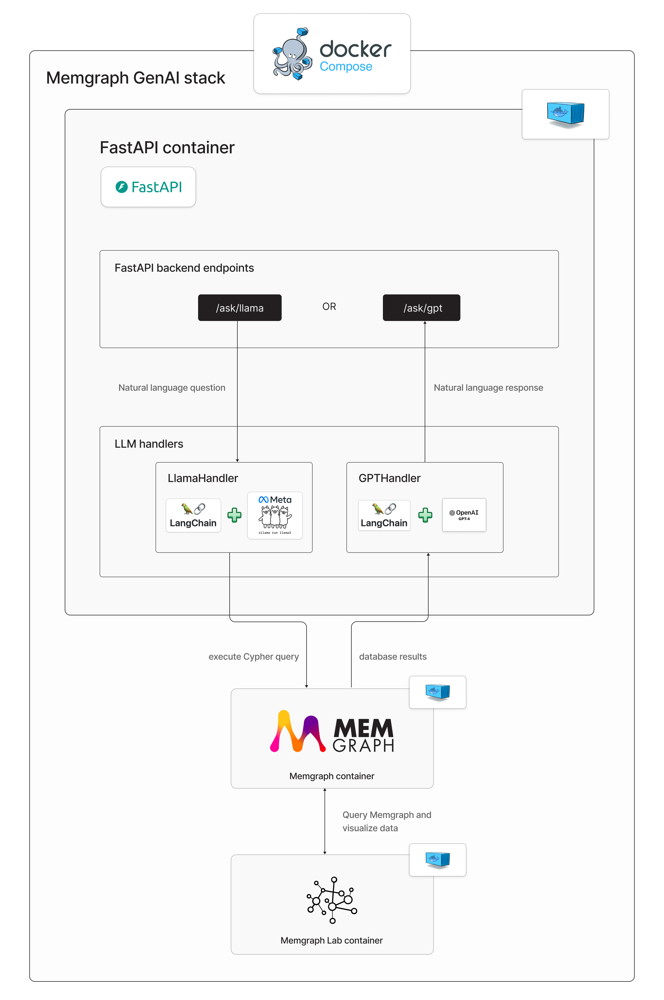

# Memgraph GenAI Stack
**Docker Compose + FastAPI + LangChain + Ollama + Memgraph**

This demo is a template for building GenAI applications with Memgraph.

## App architecture



## Dataset 
In order for schema to be generated, a dataset needs to be loaded in Memgraph before the application is started. The Game of Thrones dataset is preloaded in this demo. To preload your own dataset, update the `dataset.cypherl` file.
The first three lines in the CYPHERL file are there, so the data doesn't reload on each run. (`STORAGE MODE IN_MEMORY_ANALYTICAL; DROP GRAPH; STORAGE MODE IN_MEMORY_TRANSACTIONAL;`)

## Start the app

To utilize `GPT-4` model, create the `.env` file in the root directory and set your OpenAI API key:
```
OPENAI_API_KEY=<YOUR_OPENAI_API_KEY>
``` 

Run the app:
```
docker compose up
```

This demo offers querying Memgraph with the natural language via LangChain utilizing two different models:

- [GPT-4](#ask-memgraph-with-gpt-4)
- [Llama 3](#ask-memgraph-with-llama-3)

### Ask Memgraph with GPT-4

Ask Memgraph with GPT-4 model:
```
curl -X POST "http://localhost:8000/ask/gpt" -H "Content-Type: application/json" -d '{"question": "How many seasons there are?"}'
```

Here is the response:
```
{"question":"How many seasons there are?","response":"There are 8 seasons."}% 
```

### Ask Memgraph with Llama 3

Ask Memgraph with Llama3 model:
```
curl -X POST "http://localhost:8000/ask/llama" -H "Content-Type: application/json" -d '{"question": "How many seasons there are?"}' 
```

Here is the response:
```
{"question":"How many seasons there are?","response":"There are 8 seasons."}% 
```
